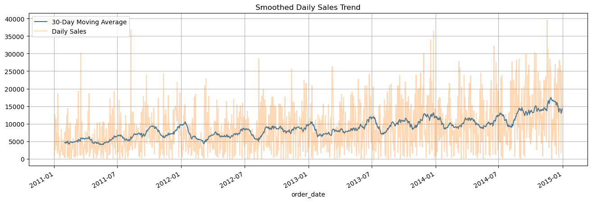

# Retail Dataset - Exploratory Data Analysis (EDA)

This repository contains an exploratory data analysis (EDA) project on a retail dataset. The goal is to explore sales, profit, and customer-related trends to support business decision-making and data-driven insights.

## Features

- Monthly analysis of total sales and profit
- Segment-wise and region-wise sales performance
- Category and sub-category level insights
- Time-based sales trends and seasonality
- Clear visualizations with business interpretations

## How to Run

1. Clone the repo
3. Run the notebook(s)

## Example Outputs

## Tech Stack

- Python
- pandas 
- NumPy
- matplotlib

## Author

Alireza Salari 
alirezasa8110@gmail.com

## License

MIT
